# Cafe POS

Cafe POS is an enterprise-oriented cafe point-of-sale platform designed as a modular monolith with a premium React operations frontend and a Laravel API backend. This repository is not a tutorial-grade CRUD sample. It is the foundation of a commercial system intended to support fast cashier throughput, inventory integrity, shift accountability, payment extensibility, and maintainable long-term software delivery.

## Manuscript Purpose

This README is the manuscript for the project. It documents:

- the product vision
- the engineering philosophy
- the architecture
- the domain model
- the runtime strategy
- the current implementation state
- the operating instructions for local development
- the roadmap for evolving the platform into a full production rollout

## Product Vision

The system targets real cafe operations where speed, reliability, and operational clarity matter more than demo completeness. The product should feel closer to Toast POS, Square POS, and modern restaurant SaaS than to a generic admin dashboard.

The software is being designed around these realities:

- cashier workflows are high-frequency and latency-sensitive
- inventory has to reflect recipes and ingredient movement, not just product counts
- payments must be extensible and auditable
- shift handoff and reconciliation are first-class workflows
- the system has to survive growth from one terminal to many
- backend architecture must stay understandable by one team for a long time

## Engineering Philosophy

The codebase follows a modular monolith strategy:

- one frontend SPA
- one Laravel backend
- one primary database
- strong module boundaries inside the monolith

This gives us:

- faster development than microservices
- simpler deployments
- easier debugging
- straightforward transactional integrity
- room to scale with queues, caching, realtime events, and horizontal app replicas

The main engineering principles are:

- SOLID
- DRY
- clean architecture
- domain-oriented structure
- dependency injection
- thin controllers
- typed DTOs and explicit contracts
- production-minded defaults

## Tech Stack

### Frontend

- React 19
- TypeScript
- Vite
- Tailwind CSS
- ShadCN-ready component structure
- Framer Motion
- TanStack Query
- Zustand
- React Router
- React Hook Form
- Zod

### Backend

- Laravel 12
- PHP 8.5 local portable runtime in `tools/php`
- Composer local portable runtime in `tools/composer.phar`
- Laravel Sanctum
- Pest
- service layer architecture
- repository pattern
- DTO pattern
- policy-based authorization

### Data and Infrastructure

- SQLite for zero-friction local execution
- PostgreSQL as the intended operational database target
- Redis-ready infrastructure layout
- Docker Compose and Nginx scaffolding

## Current Repository State

The repository is now runnable in local development.

What is already working:

- frontend dependencies installed
- frontend production build verified
- Laravel 12 backend bootstrapped
- Sanctum installed
- token-based login for terminal operators
- post-login React session loop fixed
- route-level error boundary for cleaner runtime failures
- seeded demo cashier and manager accounts
- live product catalog API
- POS frontend querying Laravel instead of local mock data
- normalized order item persistence
- SQLite local database initialized
- migrations run successfully
- Pest suite passing
- portable PHP and Composer installed inside the repository

What remains intentionally incomplete:

- full RBAC management flows
- product CRUD screens connected to mutation forms
- inventory deductions and recipe execution
- payment gateway adapters beyond the abstraction layer
- realtime kitchen board
- offline sync queue
- shift close and reconciliation workflows

## Monorepo Structure

```text
/apps
  /frontend
  /backend
  /backend-scaffold-backup
/packages
  /shared-types
  /ui-kit
/infrastructure
  /docker
  /nginx
/docs
/tools
```

### Notes

- `apps/backend` is the live Laravel application.
- `apps/backend-scaffold-backup` is the original pre-Laravel architecture scaffold preserved as a backup during the runtime promotion step.
- `tools/php` contains the local portable PHP runtime used to make the backend runnable on this machine.
- `tools/composer.phar` is the local Composer executable.

## Frontend Architecture

The frontend is structured for a POS-first experience where rapid input handling matters.

```text
/apps/frontend/src
  /api
  /components
    /layout
    /pos
    /ui
  /features
  /layouts
  /pages
  /router
  /stores
  /styles
  /types
  /utils
```

### Frontend Goals

- instant-feeling cart interactions
- route-level code splitting
- future API integration through `/api` proxying in Vite
- a reusable design system layer
- responsive cashier-friendly layouts
- predictable Zustand subscription behavior without hydration loops

### Current Frontend Experience

The current UI includes:

- operator login screen
- premium dashboard shell
- POS screen layout
- animated live product grid
- sticky cart panel
- checkout submission into the Laravel order API
- low-latency Zustand store
- Vite dev proxy for `/api` and `/sanctum`

## Backend Architecture

The backend is a Laravel 12 modular monolith with explicit domain layers.

```text
/apps/backend/app
  /DTOs
  /Enums
  /Events
  /Exceptions
  /Http
  /Interfaces
  /Listeners
  /Models
  /Policies
  /Providers
  /Repositories
  /Services
  /ValueObjects
```

### Layer Responsibilities

- `Http`: transport-only concerns such as controllers and form requests
- `DTOs`: validated data contracts moving into services
- `Services`: use-case orchestration and business workflows
- `Repositories`: persistence boundaries
- `Models`: Eloquent entities and domain-adjacent behavior
- `Policies`: authorization logic
- `Events` and `Listeners`: decoupled reactions and future realtime fanout
- `ValueObjects`: immutable primitives such as money

## Domain Model

### Users and Roles

The system models store personnel through a shared user base and explicit roles:

- `User`
- `Admin`
- `Manager`
- `Cashier`

The current implementation demonstrates:

- role enum casting
- account activation flags
- UUID identifiers
- soft deletes
- Sanctum token support

### Products

The product model uses abstraction to express domain categories:

- abstract `Product`
- `BeverageProduct`
- `FoodProduct`

This is intentionally designed to support richer downstream behaviors such as:

- recipe linkage
- modifier policies
- category-specific tax or fulfillment rules

### Payments

The payment module demonstrates real OOP strategy and polymorphism:

- `PaymentMethodInterface`
- `AbstractPaymentMethod`
- `CashPaymentMethod`
- `CardPaymentMethod`
- `GCashPaymentMethod`
- `MayaPaymentMethod`
- `PaymentManager`

This gives the codebase a clean path toward future integrations like:

- Stripe Terminal
- PayMongo
- Adyen
- QR-based local providers

### Orders

The current order flow uses:

- `CreateOrderData`
- `OrderService`
- `OrderRepositoryInterface`
- `EloquentOrderRepository`
- `OrderItem`
- `OrderCreated` event
- `BroadcastOrderToKitchen` listener scaffold

This establishes the shape for the eventual sales engine.

## API Design

The API is versioned under `/api/v1`.

Current verified endpoints:

- `GET /api/v1/health`
- `POST /api/v1/auth/login`
- `GET /api/v1/auth/me`
- `POST /api/v1/auth/logout`
- `GET /api/v1/products`
- `GET /api/v1/orders`
- `POST /api/v1/orders`
- `GET /api/v1/orders/{order}`

The products and order routes sit behind Sanctum auth. A generic authenticated `/api/user` route is also present through Laravel's API scaffolding.

## Database Strategy

### Local Runtime

Local development uses SQLite so the app can run immediately on machines without PostgreSQL.

If you want a less temporary setup, the repository now includes:

- `apps/backend/.env.pgsql.example`
- `apps/backend/.env.mysql.example`

### Target Operational Database

PostgreSQL remains the intended operational database because it provides:

- reliable transactional behavior
- stronger indexing and relational integrity
- better long-term scaling characteristics
- good fit for financial and inventory workloads

### Current Migrations

The current migration set creates:

- users
- products
- order_items
- orders
- payments
- cache tables
- jobs tables
- sanctum personal access tokens

## Realtime and Offline Strategy

These are architectural targets already reflected in the structure, even where implementation is not yet complete.

### Realtime

- Laravel Reverb-ready event/listener layout
- kitchen board broadcasts
- inventory alerts
- cashier synchronization
- order lifecycle fanout

### Offline

- local-first frontend state
- future IndexedDB queue
- deferred sync model for orders and adjustments
- conflict-handling strategy to be implemented in later phases

## Security Posture

The security direction for the project includes:

- Sanctum authentication
- policy-based authorization
- validated request objects
- versioned API boundaries
- UUIDs for external identifiers
- auditability as a first-class concern
- strict file upload validation in future CRUD modules
- secure secret handling through environment configuration

## Operational Flow

The intended service flow is:

```mermaid
flowchart LR
    A["Cashier selects products"] --> B["Frontend POS store updates cart instantly"]
    B --> C["Checkout action builds order payload"]
    C --> D["Laravel API validates request"]
    D --> E["OrderService orchestrates transaction"]
    E --> F["Repository persists order"]
    F --> G["Payment strategy captures payment"]
    G --> H["OrderCreated event dispatches"]
    H --> I["Kitchen / audit / notification listeners react"]
```



## Local Runtime Commands

### Start Everything

From the repository root:

```powershell
npm run dev
```

This uses:

- `npm run dev:backend` to serve Laravel on `http://127.0.0.1:9000`
- `npm run dev:frontend` to serve Vite on `http://127.0.0.1:5173`

### Demo Credentials

Use either of these local seeded accounts:

- `cashier@aurora.test` / `password`
- `manager@aurora.test` / `password`

### Start Backend Only

```powershell
npm run dev:backend
```

### Start Frontend Only

```powershell
npm run dev:frontend
```

### Run Backend Tests

```powershell
npm run test:backend
```

### Build Frontend

```powershell
npm run build:frontend
```

### Run Backend Migrations

```powershell
npm run migrate:backend
```

### Switch To PostgreSQL Or MySQL

From `apps/backend`:

- copy `.env.pgsql.example` to `.env` for PostgreSQL
- copy `.env.mysql.example` to `.env` for MySQL
- then run `npm run migrate:backend`

## Local Tooling Installed For This Repository

To make this machine runnable without a pre-existing PHP environment, the following were installed locally inside the repository:

- portable PHP at `tools/php`
- Composer at `tools/composer.phar`
- CA trust chain adjustments for Composer and PHP HTTPS downloads

This means the repository is self-contained enough to run the backend here without requiring a global PHP installation.

## Validation Performed

The following validations have already succeeded in this repository:

- frontend `npm install`
- frontend production build
- Laravel dependency installation
- Laravel migration run
- Laravel database seeding
- backend route registration
- backend Pest test suite
- frontend auth/session fix build verification

## Infrastructure Story

The repo includes Docker and Nginx scaffolding in:

- `docker-compose.yml`
- `infrastructure/docker`
- `infrastructure/nginx`

The local execution path currently relies on the portable PHP runtime and SQLite because it is the fastest path to a working system on this machine. The Docker and PostgreSQL path remains the intended next operational hardening step.

## Implementation Highlights

Important current files:

- login page: `apps/frontend/src/pages/LoginPage.tsx`
- frontend shell: `apps/frontend/src/layouts/AppShell.tsx`
- POS page: `apps/frontend/src/pages/PosPage.tsx`
- auth store: `apps/frontend/src/stores/auth-store.ts`
- API client: `apps/frontend/src/services/api-client.ts`
- cart store: `apps/frontend/src/stores/pos-store.ts`
- shared contracts: `packages/shared-types/src/index.ts`
- payment abstractions: `apps/backend/app/Services/Payments`
- auth service: `apps/backend/app/Services/Auth/AuthService.php`
- catalog service: `apps/backend/app/Services/Catalog/ProductCatalogService.php`
- order orchestration: `apps/backend/app/Services/Orders/OrderService.php`
- API controller: `apps/backend/app/Http/Controllers/Api/V1/OrderController.php`
- product controller: `apps/backend/app/Http/Controllers/Api/V1/ProductController.php`
- auth controller: `apps/backend/app/Http/Controllers/Api/V1/AuthController.php`
- request validation: `apps/backend/app/Http/Requests/StoreOrderRequest.php`
- repository binding: `apps/backend/app/Providers/DomainServiceProvider.php`

## Known Gaps

The system is now runnable, but it is still in the foundation stage rather than the full commercial completion stage.

Major gaps still to implement:

- role and permission management UI
- products, categories, suppliers, customers, promotions CRUD
- inventory deductions and stock movement ledger
- discounts, taxes, and promo engine
- receipt generation
- shift open and close workflows
- dashboards backed by live data
- kitchen display workflow
- audit trail expansion
- barcode integration
- offline sync engine

## Roadmap

### Phase 1

- architecture
- portable runtime bootstrap
- Laravel backend foundation
- premium POS frontend shell
- local runnable stack

### Phase 2

- auth
- roles and permissions
- real product catalog API
- order items persistence
- API resources and serializers

### Phase 3

- inventory items
- recipes
- supplier purchases
- stock adjustments
- waste tracking

### Phase 4

- payment completion
- receipts
- shifts
- analytics
- kitchen board

### Phase 5

- offline sync
- multi-terminal locking and conflict handling
- Redis, Reverb, and websocket rollout
- PostgreSQL production profile
- CI/CD and hardening

## Immediate Next Build Targets

If development continues from this point, the best next sequence is:

1. add product create and edit workflows to the frontend for manager users
2. introduce inventory items, recipes, and stock movements behind sold products
3. persist payment attempts and split-tender states
4. add receipt generation and cashier shift workflows
5. expand analytics and realtime kitchen operations

## Final Position

This repository now has a real, executable foundation for an enterprise-style cafe POS platform. It is not yet the completed commercial system described in the product vision, but it is no longer a static scaffold. It boots, builds, migrates, tests, and provides the architectural base required to keep building toward that outcome.
