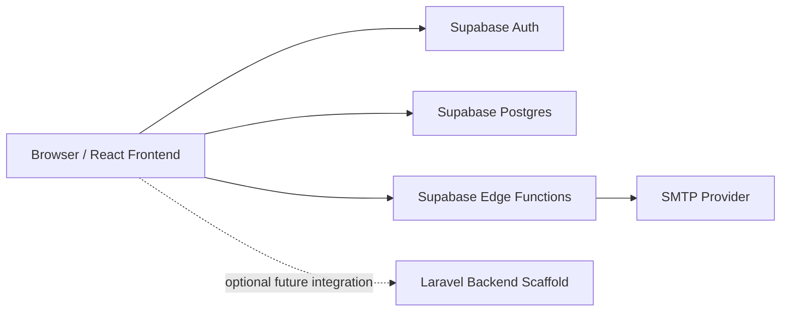

# Cozy Cafe POS

Cozy Cafe POS is a web-based point-of-sale and cafe operations management system designed for small to medium food-service environments. The current implementation provides a modern React-based cashier interface backed by Supabase for authentication, database operations, role-aware access, reporting, receipt handling, and inventory-related workflows.

## Abstract / Project Overview

Cozy Cafe POS was developed to support the daily transaction and operations workflow of a cafe or food-service establishment. The system addresses common operational problems associated with manual order taking, handwritten receipts, inconsistent inventory monitoring, delayed sales reporting, and fragmented staff administration. By combining a cashier-facing POS interface with product management, inventory tracking, discounts, reporting, receipt generation, and role-based access, the system aims to improve transaction speed, data accuracy, and managerial visibility. It is intended for use by cafe administrators, managers, and cashiers who require a centralized digital platform for order processing and operational monitoring.

## Background of the Project

Many small food-service businesses still rely on manual or partially digital workflows for order processing, stock monitoring, and daily sales consolidation. These approaches often lead to slow checkout, inconsistent product records, difficulty tracing stock movement, delayed receipt preparation, and limited visibility into business performance. In a cafe setting, such issues directly affect service quality, inventory control, and managerial decision-making.

A point-of-sale system is needed to centralize transaction handling and operational records in one platform. For a cafe, this includes maintaining a product catalog, processing dine-in and takeout orders, generating printable receipts, recording sales, monitoring stock levels, and enforcing appropriate access per staff role. Cozy Cafe POS was created to respond to these needs using a browser-based interface and a cloud-backed data layer that can support both day-to-day operations and future system expansion.

## Objectives of the System

### General Objective

To develop a centralized cafe point-of-sale system that improves transaction handling, record accuracy, stock visibility, and sales monitoring for cafe operations.

### Specific Objectives

- To authenticate cafe staff using role-based accounts.
- To manage product and category records used by the POS terminal.
- To process customer orders for dine-in, takeout, and delivery channels.
- To support multiple payment methods, including cash and manually captured digital references.
- To apply configurable discount rules during checkout.
- To generate printable receipts and support receipt email delivery.
- To record orders for dashboard and sales reporting purposes.
- To manage ingredient inventory, stock adjustments, recipes, and add-ons.
- To manage staff accounts, roles, and activation status.
- To maintain configurable business and receipt settings for store operations.

## Scope and Limitations

### Scope

- Staff members can sign in using Supabase Auth email/password accounts.
- The system provides dashboard metrics for daily revenue, order volume, active products, and low-stock monitoring.
- Cashiers can browse products, build carts, apply allowed discounts, choose payment methods, and complete orders.
- Managers and administrators can manage products, categories, discounts, ingredient inventory, recipes, add-ons, and sales reports.
- Administrators can create staff accounts and update user roles and activation status through the Team module.
- Orders can produce a dedicated receipt page for printing, and receipts can be sent by email through a Supabase Edge Function when SMTP is configured.
- Business settings such as store profile, tax rate, receipt labels, branding, and printing preferences can be stored and reused across receipts and reports.

### Limitations

- The active runtime depends on Supabase; the Laravel backend included in the repository is currently a scaffold and is not the primary API used by the live POS workflow.
- Payment gateway integration is not yet connected to real third-party processors. Digital payments currently rely on manually entered reference numbers.
- Offline mode is not implemented.
- Automated tests are minimal. The frontend test command currently passes with no test files, and the Laravel backend only contains starter example tests.
- There is no full customer relationship, loyalty, supplier purchasing, or shift reconciliation module at this stage.
- Ingredient deduction only occurs when products and add-ons are linked to recipe ingredients. Products without recipes deduct only their product stock quantity.
- Receipt email delivery requires deployed Supabase Edge Functions and valid SMTP secrets.
- The navigation hides the Settings module from cashier users, but the current route and database policy should still be hardened if strict cashier-only separation is required.

## System Features

| Module | Purpose | Main Functions | Primary Users |
| --- | --- | --- | --- |
| Authentication and Session Management | Controls system access through authenticated staff accounts. | Email/password login, session restoration, inactive-account blocking, role-aware route access. | Admin, Manager, Cashier |
| Dashboard | Gives a quick operational snapshot after login. | Revenue today, orders today, active product count, recent orders, low-stock list. | Admin, Manager, Cashier |
| POS / Ordering Module | Handles front-counter order processing. | Product search, category filtering, cart building, order channel selection, add-ons, discounts, payment method selection, cash change calculation, customer email capture, order submission, queue number generation. | Admin, Manager, Cashier |
| Product Management | Maintains the sellable menu catalog. | Product creation, update, activation/deactivation, image URL support, price and stock setup. | Admin, Manager |
| Category Management | Organizes the product catalog for cashier navigation. | Category creation, sorting, update, activation/deactivation. | Admin, Manager |
| Inventory / Ingredients Module | Tracks raw ingredients and recipe relationships. | Ingredient CRUD, stock movement logging, manual stock adjustment, low-stock monitoring, recipe mapping, add-on management, add-on ingredient mapping, product-to-add-on linking, inventory CSV export and print view. | Admin, Manager |
| Discount Management | Maintains discount rules used during checkout. | Senior, PWD, promo, and manual discount records; allowed-role configuration; expiration; enable/disable actions. | Admin, Manager |
| Orders and Receipt Management | Preserves completed transactions for later review. | Order listing, item breakdown, add-on display, receipt page, print-friendly receipt output, optional receipt email delivery. | Admin, Manager, Cashier |
| Sales Reporting | Summarizes business performance over a selected date range. | Revenue totals, average order value, best sellers, payment breakdown, category breakdown, recent transactions, printable report view, CSV export. | Admin, Manager |
| Team Management | Supports staff account administration. | Create user through Edge Function, assign roles, activate/deactivate accounts, search profiles. | Admin |
| Settings | Stores reusable operational and branding preferences. | Store profile, tax settings, receipt labels, logo, compact mode, payment-reference preference, receipt preview. | All authenticated users currently, though the interface primarily surfaces it for Admin and Manager users |

## Technology Stack

| Layer | Technologies Found in the Repository | Notes |
| --- | --- | --- |
| Frontend | React 19, TypeScript, Vite 6, React Router 7 | Primary user interface and active runtime |
| State and Data Fetching | Zustand, TanStack React Query | POS cart state and server-state caching |
| Forms and Validation | React Hook Form, Zod, `@hookform/resolvers` | Used in login and CRUD forms |
| Styling and UI | Tailwind CSS 3, custom UI components, Lucide React, Framer Motion, Sonner | Responsive cafe-themed interface |
| Backend-as-a-Service | Supabase Auth, Supabase Postgres, Supabase Edge Functions, Supabase JS v2 | Current authentication, data access, server-side receipt email and user creation |
| Database Logic | SQL migrations, Row Level Security, PL/pgSQL RPC functions | Includes `create_order`, `adjust_inventory`, and `adjust_ingredient` workflows |
| Secondary Backend Scaffold | Laravel 12, PHP 8.2+, PHPUnit starter tests | Present in `apps/backend`, but not the primary live API path today |
| Monorepo Packages | `@cafe/shared-types`, `@cafe/ui-kit` | Shared contracts and reusable UI foundations |
| Deployment and Infrastructure | Vercel configuration, Docker Compose, Nginx scaffold, Postgres/Redis containers | Frontend deployment is Vercel-ready; Docker stack reflects a broader future architecture |

## System Architecture

The active system follows a frontend-plus-Supabase architecture. The React frontend handles user interaction, routing, state management, and query orchestration. Authentication is performed through Supabase Auth using email/password accounts. After login, the frontend reads and writes operational data directly against Supabase tables and RPC functions using the Supabase JavaScript client.

Supabase Postgres stores operational entities such as profiles, products, categories, orders, order items, discounts, business settings, ingredients, recipes, add-ons, and inventory adjustments. Row Level Security policies restrict access based on the authenticated user and the role stored in the `profiles` table. Sensitive server-side actions are handled by Supabase Edge Functions: `create-user` provisions staff accounts using the service role key, and `send-receipt-email` renders and sends receipts without exposing SMTP credentials to the browser.

The repository also contains a Laravel application under `apps/backend`. At present, this service is scaffold-level only and is not the main backend for the running POS workflow. Its Vite proxy configuration and Docker files indicate a future direction toward a fuller multi-service deployment, but current POS, inventory, reporting, and receipt operations are Supabase-backed.



## Database / Data Model Overview

The following entities are implemented in the Supabase migration set and are used by the current application:

| Entity | Purpose | Key Notes |
| --- | --- | --- |
| `profiles` | Stores application users and roles. | Linked to `auth.users`; includes `role` and `is_active`. |
| `categories` | Groups menu items. | Used for product organization and POS filtering. |
| `products` | Stores sellable items. | Includes SKU, price, stock quantity, image URL, active status, and low-stock threshold. |
| `discounts` | Stores discount rules. | Includes scope, value type, allowed roles, activation status, and optional expiration. |
| `orders` | Stores completed transactions. | Includes order number, queue number, payment details, totals, customer email, and receipt settings snapshot. |
| `order_items` | Stores line items per order. | Preserves product name snapshots for historical receipts. |
| `order_item_addons` | Stores add-ons applied to order items. | Preserves add-on name, price delta, and quantity per order line. |
| `inventory_adjustments` | Stores stock movements for product-level inventory. | Used for manual adjustments and product deductions on sale. |
| `ingredients` | Stores raw ingredients and consumables. | Tracks quantity on hand, unit, supplier, cost, and threshold. |
| `ingredient_adjustments` | Stores ingredient movement history. | Includes stock-in, stock-out, waste, manual, and sale deductions. |
| `product_ingredients` | Maps products to recipe ingredients. | Enables ingredient-based deduction during checkout. |
| `product_addons` | Stores add-on/modifier definitions. | Supports paid modifiers such as extras or customizations. |
| `product_addon_ingredients` | Maps add-ons to ingredient consumption. | Enables ingredient deduction for modifiers. |
| `product_addon_links` | Maps products to allowed add-ons. | Controls which modifiers appear in the POS modal. |
| `business_settings` | Stores store-wide configuration. | Includes branding, receipt, tax, stock-warning, and payment-reference settings. |
| `private.order_queue_counters` | Tracks daily queue counters. | Used internally to generate queue numbers like `Q001`. |

## User Roles and Permissions

The implemented roles found in the codebase are `admin`, `manager`, and `cashier`.

| Role | Current Access in the Application |
| --- | --- |
| Admin | Full access to dashboard, POS, products, orders, inventory, discounts, sales reports, team management, and settings. Can create staff accounts, change roles, and activate/deactivate profiles. |
| Manager | Access to dashboard, POS, products, orders, inventory, discounts, sales reports, and settings. Cannot access the Team page in the router. |
| Cashier | Access to dashboard, POS, products, orders, and receipt pages. Cashiers are redirected away from inventory, sales, discounts, and team routes. Cashiers can complete orders and apply only the discounts permitted by the selected discount rule. |

**Implementation note:** the sidebar hides Settings from cashiers, but the current `/settings` route is not separately wrapped in a role guard. This should be treated as a known hardening item rather than a fully enforced cashier restriction.

## Installation and Setup Guide

### Prerequisites

- Node.js 22 or later
- npm
- A Supabase project
- Supabase dashboard access for applying SQL migrations
- Optional: Supabase CLI for Edge Function deployment
- Optional: PHP 8.2+ only if you plan to work on the Laravel scaffold

### 1. Clone the Repository

```powershell
git clone <repository-url>
cd cafe
```

### 2. Install Frontend and Workspace Dependencies

```powershell
npm install
```

### 3. Configure Frontend Environment Variables

Create `apps/frontend/.env` and supply your own Supabase project values. The committed example file should be treated only as a structural reference.

```env
VITE_SUPABASE_URL=your_supabase_url
VITE_SUPABASE_PUBLISHABLE_KEY=your_supabase_publishable_key
```

### 4. Prepare the Supabase Database

Create a Supabase project, then apply the SQL files inside `supabase/migrations/` in chronological order using the Supabase SQL Editor or your normal Supabase migration workflow.

Recommended order:

1. `20260510000001_init_cafe_pos.sql`
2. `20260510000002_cozy_cafe_operations_phase.sql`
3. `20260510000003_security_cleanup.sql`
4. `20260510000004_fix_pos_rpc_ambiguous_columns.sql`
5. `20260511000005_ingredient_inventory_addons_admin_users.sql`
6. `20260511000006_fix_inventory_addons_schema.sql`
7. `20260511000007_seed_inventory_addons_demo_data.sql`
8. `20260512000001_fix_create_order_ambiguous_id.sql`
9. `20260514000008_business_settings_and_queue_numbers.sql`
10. `20260516000009_performance_search_indexes.sql`

This migration set creates the operational schema, roles, RLS policies, seeded demo categories/products/discounts/ingredients, queue numbers, business settings, and order/inventory RPC functions used by the frontend.

### 5. Seed Demo Users

After the frontend environment points to your Supabase project and the database schema is ready, seed the demo accounts:

```powershell
npm run seed:supabase-users
```

The seed script creates demo `admin`, `manager`, and `cashier` accounts for local or academic demonstration use. Review `scripts/seed-supabase-demo-users.mjs` before using those accounts in any non-demo environment.

### 6. Configure Supabase Edge Functions

The Team module and receipt email feature rely on Supabase Edge Functions.

Create a private file at `supabase/functions/.env.local` with your server-side secrets:

```env
SUPABASE_URL=your_supabase_url
SUPABASE_ANON_KEY=your_supabase_anon_key
SUPABASE_SERVICE_ROLE_KEY=your_supabase_service_role_key
SMTP_HOST=smtp.gmail.com
SMTP_PORT=465
SMTP_SECURE=true
SMTP_USER=your-email@gmail.com
SMTP_PASS=your-google-app-password
SMTP_FROM_NAME=Cozy Cafe POS
SMTP_FROM_EMAIL=your-email@gmail.com
SMTP_REPLY_TO=your-email@gmail.com
```

Push secrets and deploy the functions:

```powershell
npx supabase secrets set --env-file supabase/functions/.env.local
npx supabase functions deploy create-user
npx supabase functions deploy send-receipt-email
```

Keep JWT verification enabled for both functions.

### 7. Start the Frontend

```powershell
npm run dev
```

The current root `dev` script starts the frontend development server. The application is served through Vite, typically at `http://127.0.0.1:5173`.

You may also run the frontend explicitly:

```powershell
npm run dev:frontend
```

### 8. Optional: Start the Laravel Scaffold

The Laravel application is not required for the current Supabase-backed POS flow. If you want to inspect or continue backend scaffold work, install Composer dependencies first:

```powershell
.\tools\php\php.exe .\tools\composer.phar install --working-dir=apps/backend
```

Then serve the scaffold:

```powershell
npm run dev:backend
```

Or start the legacy paired frontend/backend development command:

```powershell
npm run dev:legacy
```

At present, this Laravel app mainly exposes the default Laravel welcome route and health route rather than the active POS features.

## Environment Variables

### Frontend (`apps/frontend/.env`)

| Variable | Description | Example |
| --- | --- | --- |
| `VITE_SUPABASE_URL` | Supabase project URL used by the browser client. | `VITE_SUPABASE_URL=https://your-project.supabase.co` |
| `VITE_SUPABASE_PUBLISHABLE_KEY` | Supabase publishable/anon key used by the browser client. | `VITE_SUPABASE_PUBLISHABLE_KEY=your_supabase_publishable_key` |

### Supabase Edge Functions (`supabase/functions/.env.local`)

| Variable | Description | Example |
| --- | --- | --- |
| `SUPABASE_URL` | Supabase project URL for server-side Edge Functions. | `SUPABASE_URL=https://your-project.supabase.co` |
| `SUPABASE_ANON_KEY` | Supabase anon key used by the function runtime. | `SUPABASE_ANON_KEY=your_supabase_anon_key` |
| `SUPABASE_SERVICE_ROLE_KEY` | Service role key for privileged server-side operations such as account creation. | `SUPABASE_SERVICE_ROLE_KEY=your_service_role_key` |
| `SMTP_HOST` | Mail server hostname for receipt delivery. | `SMTP_HOST=smtp.gmail.com` |
| `SMTP_PORT` | Mail server port. | `SMTP_PORT=465` |
| `SMTP_SECURE` | Whether to use implicit TLS. | `SMTP_SECURE=true` |
| `SMTP_USER` | SMTP login username. | `SMTP_USER=your-email@gmail.com` |
| `SMTP_PASS` | SMTP login password or app password. | `SMTP_PASS=your-google-app-password` |
| `SMTP_FROM_NAME` | Sender display name for receipt emails. | `SMTP_FROM_NAME=Cozy Cafe POS` |
| `SMTP_FROM_EMAIL` | Sender email address. | `SMTP_FROM_EMAIL=your-email@gmail.com` |
| `SMTP_REPLY_TO` | Optional reply-to address. | `SMTP_REPLY_TO=your-email@gmail.com` |

## Usage Guide

### 1. Log In

- Open the frontend in the browser.
- Sign in using a valid Supabase staff account.
- The system restores authenticated sessions automatically on refresh when possible.

### 2. Review the Dashboard

- After login, review the Overview page for revenue today, active products, recent orders, and low-stock indicators.

### 3. Manage Products and Categories

- Open the Products module.
- Add or edit categories to group menu items.
- Add or edit products with SKU, description, image URL, price, stock quantity, and low-stock threshold.
- Managers and admins can archive or restore catalog records.

### 4. Process an Order

- Open the POS screen.
- Search or filter products by category.
- Add items to the cart.
- If a product has linked add-ons, choose modifiers before adding the item.
- Select the order channel: dine-in, takeout, or delivery.

### 5. Complete Payment

- Open checkout from the cart.
- Optionally apply an allowed discount.
- Choose the payment method.
- For cash payments, enter the tendered amount.
- For GCash, QR, or InstaPay, provide a payment reference if required by settings.
- Optionally add order notes and a customer email.
- Complete the order to generate an order number, queue number, totals, and inventory deductions.

### 6. Print or Email the Receipt

- After checkout, open the receipt page.
- Use the print action for a paper-ready receipt view.
- If `send-receipt-email` is deployed and SMTP is configured, send the receipt to the customer email or another recipient.

### 7. Review Orders and Sales

- Use the Orders module to inspect completed transactions and print past receipts.
- Use the Sales module to filter by date range and review totals, payment breakdown, best sellers, and transaction listings.
- Export or print the report for operational review or presentation.

### 8. Manage Inventory, Recipes, and Add-ons

- Use the Inventory module to maintain ingredients and stock movements.
- Map ingredients to products to enable recipe-based stock deduction.
- Create add-ons, link them to ingredients, then attach them to products.
- Review movement history and export the current ingredient report as CSV.

### 9. Maintain Staff and Settings

- Administrators can use Team to create users and update role/access status.
- Use Settings to maintain store profile, receipt labels, tax rate, branding, and POS preferences.

## Testing and Validation

### Current Automated Testing Status

- Frontend test command exists and currently completes with no test files.
- Laravel backend contains only starter example tests from the scaffold.
- The repository therefore relies heavily on manual validation at this stage.

### Available Commands

```powershell
npm run test:frontend
```

Optional scaffold-only backend test command after Composer dependencies are installed:

```powershell
npm run test:backend
```

### Recommended Manual Testing Checklist

- Login test: verify valid staff accounts can sign in and inactive accounts are blocked.
- Product CRUD test: create, edit, archive, and restore products and categories.
- POS flow test: add items, adjust quantities, choose add-ons, and submit an order.
- Discount validation test: confirm role-allowed discounts apply correctly and restricted discounts are blocked.
- Payment validation test: verify cash change computation and digital reference validation.
- Receipt generation test: confirm order totals, queue number, cashier name, and printable receipt layout.
- Receipt email test: deploy `send-receipt-email` and verify successful delivery to a valid inbox.
- Inventory deduction test: confirm product-level deduction for stock-tracked items and ingredient deduction for recipe-linked products.
- Inventory adjustment test: perform stock-in, stock-out, waste, and manual ingredient adjustments.
- Sales report test: filter by date range and confirm totals, top items, and payment breakdown values.
- Role permission test: confirm admin, manager, and cashier navigation and route restrictions behave as expected.
- Responsive UI test: review login, POS, orders, and dashboard pages on desktop and mobile widths.

## Deployment Guide

### Frontend Deployment

The repository contains a `vercel.json` file configured for the frontend:

- Install command: `npm install`
- Build command: `npm run build --workspace @cafe/frontend`
- Output directory: `apps/frontend/dist`
- SPA rewrite: all routes rewrite to `index.html`

For production deployment:

1. Create a production Supabase project or prepare an existing one.
2. Apply the migration files in `supabase/migrations/`.
3. Set production frontend environment variables in Vercel.
4. Deploy the frontend using the Vercel project configuration already present in the repository.

### Backend / API Deployment

The Laravel backend is not the active production dependency of the current POS workflow. If you later promote it into a live API service, you will need to:

- install Composer dependencies,
- configure its own environment file,
- provision a database and queue/cache services,
- define real API routes and authorization layers,
- and validate deployment separately from the current Supabase-backed frontend.

The Docker and Nginx files in the repository reflect this broader future architecture, but they should not be treated as the primary validated deployment path for the present system.

### Database and Edge Functions in Production

- Apply all Supabase SQL migrations to the production project.
- Deploy `create-user` and `send-receipt-email` with production secrets.
- Keep `SUPABASE_SERVICE_ROLE_KEY` and SMTP credentials server-side only.
- Confirm Row Level Security policies behave correctly using real role-based accounts.

### Common Deployment Issues

- Missing migrations can cause frontend schema errors such as missing tables, relationships, or RPC functions.
- Missing `create-user` deployment prevents admin staff creation from the Team page.
- Missing SMTP or service-role secrets breaks receipt emailing.
- Using sample or old environment values from example files can point the frontend to the wrong Supabase project.
- If digital payments are configured to require references, checkout will reject incomplete payment data.

## Screenshots

> Add screenshots of the login page, dashboard, POS screen, product management, receipt preview, and reports page here.

## Future Enhancements

- Introduce a true offline-first transaction queue for unstable network conditions.
- Add richer automated test coverage for frontend state, POS flows, and database-backed features.
- Improve mobile cashier ergonomics and compact layouts for smaller devices.
- Add advanced analytics, trend comparisons, and managerial export formats.
- Expand inventory forecasting and ingredient consumption planning.
- Add customizable receipt templates and printer-specific formatting options.
- Introduce audit logs for administrative actions and sensitive changes.
- Add backup, restore, and recovery procedures for operational continuity.
- Expand the Laravel scaffold or replace it with a clearly defined production API if a separate backend becomes necessary.

## Contributors

Contributor information is not explicitly documented in the repository at this time.

Suggested academic format:

- Add project member names
- Add roles or responsibilities
- Add school, course, or capstone affiliation if required

## License

License information has not yet been specified.
